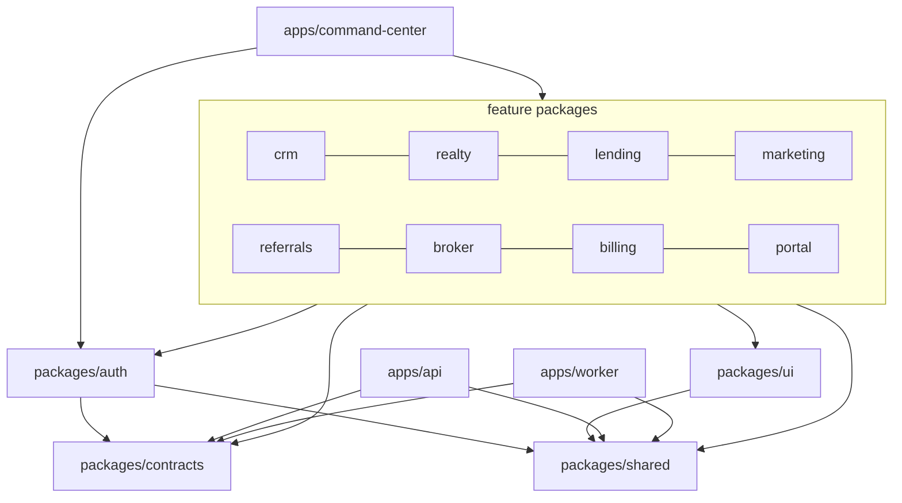
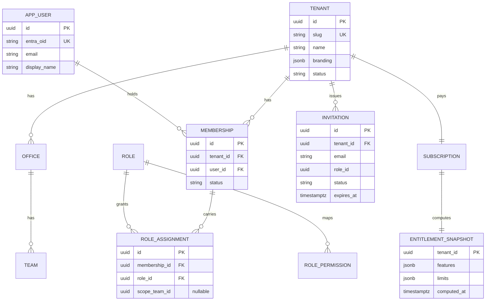
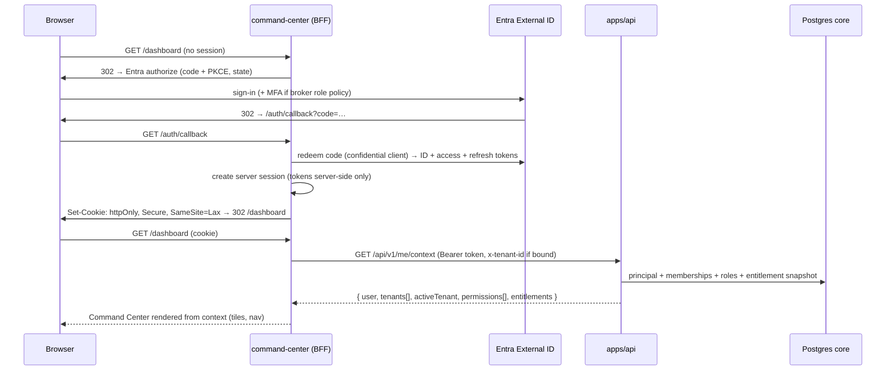
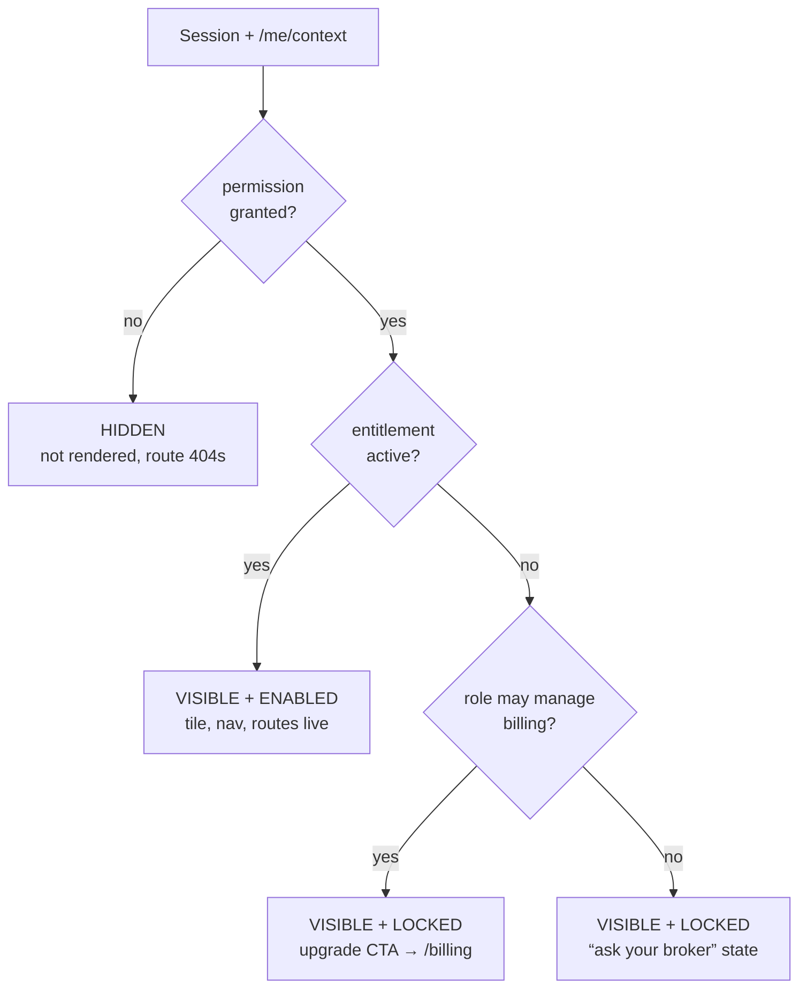
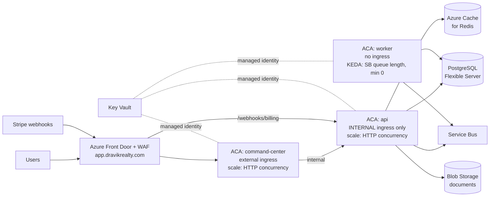

# DRAVIK Platform — Implementation Specification

> Status: Draft for approval · Date: 2026-06-10
> **Living phase status & roadmap:** [../planning/phases.md](../planning/phases.md).
> Supersedes the `apps/web` frontend layout in [platform-foundation.md](platform-foundation.md) per
> approved product direction: single entry point `app.dravikrealty.com`, DRAVIK Command Center as
> the host application, feature modules as workspace packages. All other foundation decisions
> (Entra External ID, shared Postgres + schema-per-module + RLS, modular-monolith API, ACA) carry
> forward and are refined here.
> Constraint honored throughout: **logical separation first, physical separation later. No
> microservices. No rebuild. Prototype UI behavior is preserved at every step.**

---

## 1. Final target repository structure

```
dravik/
├─ apps/
│  ├─ command-center/            # Next.js host app — the ONLY frontend deployable
│  │  ├─ app/                    # route tree; pages are thin re-exports from packages
│  │  │  ├─ (shell)/             # authenticated broker chrome (sidebar, header, tiles)
│  │  │  │  ├─ dashboard/        # Command Center home (tiles + KPIs)
│  │  │  │  ├─ crm/… realty/… lending/… marketing/… referrals/… broker/… billing/…
│  │  │  ├─ portal/              # client realm — separate chrome, same deployable
│  │  │  └─ (auth)/              # sign-in/out/callback routes (BFF)
│  │  └─ src/                    # shell-only code: navigation, tiles, global search,
│  │                             # notifications, module registry composition
│  ├─ api/                       # modular-monolith API service (see §4)
│  └─ worker/                    # outbox dispatcher, Service Bus consumers, scheduled jobs
│
├─ packages/
│  ├─ crm/                       # leads, inbox, prospecting        (feature package)
│  ├─ realty/                    # mapping/IDX, transactions        (feature package)
│  ├─ lending/                   # mortgage pipeline                (feature package)
│  ├─ marketing/                 # campaigns, landing pages, flyers (feature package)
│  ├─ referrals/                 # partner network, splits          (feature package)
│  ├─ broker/                    # team, reports, settings          (feature package)
│  ├─ billing/                   # plans, subscription mgmt UI      (feature package)
│  ├─ portal/                    # client-facing views              (feature package)
│  ├─ auth/                      # session, Entra OIDC client, principal context,
│  │                             # route guards, useAccess() hooks
│  ├─ ui/                        # design system: tokens, primitives (from components/ui +
│  │                             # Tailwind theme), no data access
│  ├─ contracts/                 # per-module zod schemas, API client types, module manifests
│  └─ shared/                    # framework-free utils (cn, currency/date formatting, ids)
│
├─ db/
│  └─ migrations/{core,crm,realty,lending,marketing,referrals,broker,billing,portal,reporting}/
├─ infra/                        # Bicep or Terraform: ACA env, Postgres, Redis, SB, FD, KV, ACR
├─ docs/architecture/            # this spec, foundation doc, ADRs
├─ .github/workflows/
├─ turbo.json  pnpm-workspace.yaml  package.json
```

Feature package internal layout (uniform across all eight):

```
packages/<module>/
├─ src/
│  ├─ pages/          # page-level components (what app routes re-export)
│  ├─ components/     # module-private components
│  ├─ data/           # repository interface + fixture impl (Phase 3a) → API impl (Phase 3b)
│  ├─ manifest.ts     # ModuleDescriptor: id, title, icon, basePath, permission, entitlement
│  └─ index.ts        # ONLY public surface
└─ package.json       # declares allowed deps explicitly (first boundary enforcement layer)
```

**Decisions and tradeoffs:**

- **Backend module code stays in `apps/api/src/modules/*`**, mirroring package names — not inside
  the feature packages. Full-stack packages (frontend + backend in one package) look elegant but
  couple a UI change to an API deployable and confuse the dependency graph (api would depend on
  React-adjacent packages). The shared piece is `packages/contracts`, which both sides import.
- **Current `src/app/(shell)/[module]` catch-all is retained** in command-center as the
  locked/coming-soon/upgrade surface (see §12).
- **Mapping from today's prototype** — every current folder has a destination:
  `components/{leads,inbox,prospecting}` → `packages/crm`; `{mapping,transactions}` →
  `packages/realty`; `mortgage` → `packages/lending`; `marketing` → `packages/marketing`;
  `referral` → `packages/referrals`; `{team,reports,settings}` → `packages/broker`;
  `portal` → `packages/portal`; `components/ui` + Tailwind tokens → `packages/ui`;
  `lib/utils` → `packages/shared`; `components/{layout,dashboard}` + `src/app` →
  `apps/command-center`; `src/data/*` fixtures move into their owning package's `src/data/` (then
  die in Phase 4); `src/types/*` move into `packages/contracts`.

## 2. Package boundary rules



Rules (each enforced, not aspirational):

| # | Rule | Enforced by |
|---|---|---|
| B1 | Feature packages never import each other. No exceptions — not even types. | package.json deps + eslint-boundaries in CI |
| B2 | Cross-module UI composition happens only in `apps/command-center` (dashboard tiles, global search results). | boundaries config: only `apps/*` may import >1 feature package |
| B3 | Every package is consumed only via its `index.ts`. Deep imports (`@dravik/crm/src/...`) fail lint. | `no-restricted-imports` + package `exports` field |
| B4 | `contracts` and `shared` import nothing from the workspace. `ui` imports only `shared`. `auth` imports only `contracts` + `shared`. | package.json deps |
| B5 | `apps/api` and `apps/worker` import only `contracts` + `shared` (never React packages). | package.json deps |
| B6 | Cross-module *data* needs go through the API (e.g., Marketing's property picker calls the Realty read endpoint via `contracts` client), never through another package's fixtures. | code review + B1 |
| B7 | `GlobalSearch` and `DashboardClient` (today's two boundary violators) become Command Center features backed by dedicated API endpoints (`/search`, `/dashboard/summary`). | Phase 4 conversion |

The dependency-cruiser/eslint-boundaries config runs in CI from day one of the re-org; a PR that
violates B1–B5 cannot merge. This is the single highest-leverage control in the whole plan.

## 3. Module ownership map

| Module | Frontend package | API module | DB schema | Routes (under app.dravikrealty.com) | Current prototype source |
|---|---|---|---|---|---|
| Command Center | `apps/command-center` (host) | `platform` (me/context, search, dashboard) | `core`, `reporting` | `/dashboard`, `/search` | `components/{layout,dashboard}` |
| CRM | `packages/crm` | `modules/crm` | `crm` | `/crm/leads`, `/crm/inbox`, `/crm/prospecting` | leads, inbox, prospecting |
| Realty | `packages/realty` | `modules/realty` | `realty` | `/realty/mapping`, `/realty/transactions` | mapping, transactions |
| Lending | `packages/lending` | `modules/lending` | `lending` | `/lending` | mortgage |
| Marketing | `packages/marketing` | `modules/marketing` | `marketing` | `/marketing` | marketing |
| Referrals | `packages/referrals` | `modules/referrals` | `referrals` | `/referrals` | referral |
| Broker Suite | `packages/broker` | `modules/broker` | `broker` | `/broker/team`, `/broker/reports`, `/broker/settings` | team, reports, settings |
| Billing | `packages/billing` | `modules/billing` | `billing` | `/billing` | (new; absorbs CommissionBilling et al.) |
| Client Portal | `packages/portal` | `modules/portal` | `portal` | `/portal/*` (client realm) | portal |

Route note: moving `/leads` → `/crm/leads` etc. namespaces URLs by module, which keeps ingress
re-pointing trivial at extraction time. Add permanent redirects from the old prototype paths so
nothing breaks mid-migration. (Alternative: keep flat URLs and maintain a route→module map — viable,
but the map becomes one more thing to keep correct; namespaced paths are self-describing.)

## 4. API module layout

```
apps/api/src/
├─ platform/                    # not a business module — the spine
│  ├─ tenancy/                  # tenant resolution, membership verification
│  ├─ identity/                 # Entra token validation, principal resolution, /me/context
│  ├─ rbac/                     # role/permission tables, policy evaluation
│  ├─ entitlements/             # snapshot reads, gate middleware
│  ├─ audit/                    # append-only audit writes
│  ├─ search/                   # cross-module search (federates module search providers)
│  └─ http/                     # pipeline assembly, problem+json, idempotency, rate limits
├─ modules/
│  └─ <module>/                 # crm, realty, lending, marketing, referrals, broker, billing, portal
│     ├─ routes.ts              # mounts at /api/v1/<module>/…
│     ├─ service.ts             # business logic; the only caller of repo
│     ├─ repo.ts                # SQL against OWN schema only
│     ├─ events.ts              # outbox writes + consumed-event handlers
│     └─ index.ts               # public surface for in-process cross-module calls
└─ main.ts
```

Request pipeline (fixed order, applied to every `/api/v1` route):

`authenticate (Entra JWT) → resolve principal + memberships (cached) → bind tenant context
(x-tenant-id header, verified against membership; SET LOCAL app.tenant_id) → RBAC permission check
(route-declared, e.g. crm.leads.read) → entitlement gate (module-declared) → handler`

Conventions: RFC 9457 problem+json errors; cursor pagination; `Idempotency-Key` required on
money/messaging mutations; OpenAPI generated from `contracts` zod schemas and diff-checked in CI
(a contract change without a regenerated spec fails the build).

## 5. PostgreSQL schema plan

One Flexible Server, one database. Schemas and their principal tables (DDL comes with each
module's Phase-4 migration, not in this spec):

| Schema | Tables (initial) |
|---|---|
| `core` | tenant, office, team, app_user, membership, role, role_permission, role_assignment, invitation, audit_event, outbox |
| `crm` | lead, lead_activity, conversation, message, prospecting_campaign, seller_lead, outbox |
| `realty` | property, transaction, transaction_party, commission_line, outbox |
| `lending` | loan_application, loan_document, loan_condition, outbox |
| `marketing` | campaign, template, landing_page, flyer, outbox |
| `referrals` | partner_agent, referral, split_agreement, outbox |
| `broker` | agent_profile, commission_plan, compliance_item, tenant_settings, outbox |
| `billing` | plan, plan_version, subscription, subscription_addon, entitlement_snapshot, webhook_inbox, usage_record, outbox |
| `portal` | portal_grant, document_share, outbox |
| `reporting` | materialized read models fed by events (dashboard_kpis, lead_funnel, production) |

Standing conventions:

- Every tenant-scoped table: `id uuid (v7) PK`, `tenant_id uuid NOT NULL`, `created_at/updated_at
  timestamptz`, RLS policy on `tenant_id = current_setting('app.tenant_id')::uuid`.
- FKs only within a schema; cross-schema references are bare UUIDs validated in the service layer.
- No cross-schema JOINs in module repos (lint/review rule); `reporting` is the only schema the
  dashboard reads.
- Each schema has its own `outbox`; the worker tails all outboxes and publishes to Service Bus
  topics named `dravik.<module>.<event>.v1`.
- Migrations: per-schema folders, `core` first; applied by an ACA Job before traffic shift.
- Lending PII columns (income, credit score) flagged for application-layer encryption from their
  first migration — retrofitting column encryption is far costlier than starting with it.

## 6. Multi-tenant data model



Tenant resolution under the single-domain decision (this changes from the foundation doc's
custom-domain resolution):

1. User signs in at `app.dravikrealty.com`; session is created with no tenant bound.
2. Memberships are loaded. One membership → auto-bind. Multiple (referral-network agents,
   platform admins) → tenant switcher; choice stored in session.
3. Every BFF→API call carries `x-tenant-id`; the API **re-verifies membership on every request** —
   the header is a claim to be checked, never trusted.
4. White-label custom domains remain possible later as a pure addition (Front Door routes a custom
   host to the same app; host pre-selects the tenant) — nothing in this model blocks it.

Client-realm users are ordinary `app_user` rows whose memberships carry only the `client` role and
whose data access flows exclusively through `portal.portal_grant` rows (grant = client user ↔
transaction/loan). No grant, no data — independent of RLS, which still applies beneath.

## 7. Microsoft Entra External ID integration plan

- **One external tenant** (CIAM) for all end users — agents, brokers, clients. DRAVIK staff stay in
  the corporate workforce tenant; `platform_admin` access is a separate, audited path.
- **App registrations:** `dravik-command-center` (confidential web client; redirect URIs for the
  BFF only) and `dravik-api` (exposes `api.access` scope). Single sign-in surface follows the
  single-app product decision; the previously planned separate portal registration is folded in.
  Revisit only if the portal ever needs different conditional-access/session policies than the
  shell — the split is additive later.
- **Custom URL domain** `login.dravikrealty.com` for the Entra-hosted pages so users never see a
  `ciamlogin.com` URL — material for a white-label product.
- **Sign-in methods:** email+password and email OTP at launch; social IdPs optional, portal clients
  only. **MFA enforced for all broker-side roles**; optional for clients.
- **Self-service sign-up disabled.** All accounts originate from an Invitation (agent: invited by
  broker admin; client: invited via a transaction share). The redemption flow ties the new Entra
  `oid` to the pending membership.
- **Thin tokens:** `oid`, `email`, `name` only. Roles, tenants, and entitlements are deliberately
  *not* in tokens (per-tenant roles don't fit app roles; entitlements change mid-session; stale
  claims become authz bugs). The API resolves all of that from `core` with a short-TTL cache.
- Token lifetimes: default access/refresh policies; sessions are BFF cookies (below), so browser
  exposure is nil. Sign-out clears the BFF session and round-trips Entra logout.

## 8. Authentication flow



Rules: tokens never reach the browser; refresh happens server-side in the BFF; session fixation
guarded by rotating the session id at login; CSRF covered by SameSite plus an explicit token on
state-changing BFF endpoints; `client`-role principals are redirected to `/portal` as their landing
surface instead of `/dashboard`.

## 9. Role-based authorization model

Four layers, evaluated in order — each layer can only narrow, never widen:

1. **Authentication** — valid Entra token → `oid`.
2. **Tenant binding** — `x-tenant-id` verified against an active Membership.
3. **Permission check** — every API route declares one permission (`module.resource.action`).
   Role→permission mappings live in `core` and ship as seed data.
4. **Resource scope** — repository predicates: own records (agent), team records (team_lead),
   tenant records (broker_admin+), granted records only (client).

Seed roles → permission profile (summary):

| Role | Scope summary |
|---|---|
| `platform_admin` | Cross-tenant, DRAVIK staff only, every action audited with reason capture |
| `broker_owner` | All modules, tenant-wide, including billing.subscription.manage |
| `broker_admin` | All modules tenant-wide except subscription/plan changes |
| `team_lead` | Agent permissions widened to team scope; team reports |
| `agent` | CRM/Realty/Referrals/Marketing on own records; read on team dashboards |
| `lending_officer` | Lending full + read on linked CRM/Realty records |
| `marketing_manager` | Marketing full + property read |
| `client` | Portal only; rows reachable via portal_grant; nothing else resolves |

UI obeys the same model through `packages/auth`'s `useAccess()` (fed by `/me/context`) — but UI
gating is UX, not security; the API check is the enforcement. The current hardcoded `"Chris M."`
filter becomes layer 4.

## 10. Subscription entitlement model

Entitlements answer "what did this tenant pay for" — orthogonal to roles ("what can this person
do"). A broker_owner on a Core plan still has no Lending.

- **Feature keys** are flat strings owned by `contracts`: gates (`lending.enabled`), capacities
  (`crm.seats`, `marketing.landing_pages`), metered allowances (`marketing.sms_credits`).
- **Plan versions** bundle feature values; tenants ride a plan version + add-ons + manual
  enterprise overrides.
- **EntitlementSnapshot** = the computed result, one row per tenant, mirrored into Redis.
  Recomputed only on Billing events (subscription changed, add-on purchased, override applied,
  dunning state change). Enforcement reads the snapshot — never recomputes inline.
- **Enforcement points:** (1) API middleware → `403 entitlement_required` problem type;
  (2) Command Center tiles/nav (§12); (3) creation-time limit checks (seat invite, page publish);
  (4) worker decrements metered usage.
- **Grace policy** lives in the snapshot computation: `past_due` → read-only features rather than
  lockout; `canceled` → export-only window. One place, one policy.

## 11. Billing module design

- **Provider: Stripe Billing** (subscriptions, dunning, tax, payment methods). Azure Marketplace
  can be added later as a second source feeding the same subscription table; don't build a
  subscription state machine in-house.
- **`billing.webhook_inbox`** stores every Stripe event id before processing (idempotent inbox —
  Stripe redelivers). Processing maps provider state → `subscription` rows → recompute snapshot →
  outbox event `dravik.billing.entitlements_changed.v1` → worker invalidates Redis and notifies
  the shell (next context fetch picks it up).
- **Module surface:** `packages/billing` UI is visible to `broker_owner` only — current plan,
  seats, usage meters, upgrade/downgrade (Stripe Checkout/customer portal hand-off), invoices.
- **Commission money flows** (disbursements on closed transactions) are a later Billing concern;
  the schema reserves `usage_record`/disbursement space but Phase 5 ships subscriptions only.
- The three commission UI fragments in today's prototype (settings/CommissionBilling,
  transactions/CommissionBreakdown, team/CommissionSettings) migrate per the foundation doc:
  plans→broker, lines→realty, payouts→billing.

## 12. Command Center module access logic

Each feature package exports a static `ModuleDescriptor` from its manifest; the shell owns the
registry and composes access:

```
ModuleDescriptor {
  id: "crm" | "realty" | …
  title, icon, basePath
  requiredPermission: "crm.access"          // role gate
  requiredEntitlement: "crm.enabled"        // subscription gate
  tileSummaryEndpoint?: "/api/v1/crm/summary"   // optional KPI on the tile
}
```



The three-state distinction is deliberate product surface: **hidden** (no permission — a client
never sees Lending exists), **locked-upgradeable** (entitlement missing, viewer can buy — expansion
revenue), **locked-informational** (entitlement missing, viewer can't buy). The existing
`[module]` catch-all page is repurposed as the locked-state renderer.

Server-side mirror: the same decision runs in route guards (BFF) and API middleware — nav hiding is
never the security boundary. `client`-role principals get the portal chrome and only the portal
module resolves; their "Command Center" is the portal dashboard.

## 13. Container Apps architecture



- One ACA environment per stage (dev / staging / prod); identical Bicep/Terraform module.
- `api` internal-only; Stripe webhooks enter via a dedicated Front Door route to a
  signature-verified endpoint (the one exception, allow-listed by path).
- Managed identities for every dependency; zero connection strings in app config.
- Migration runner is an **ACA Job** executed before revision traffic shift.
- Revisions give blue/green per app; worker scales to zero off-hours.
- Extraction path unchanged: an extracted module becomes a fourth ACA app; Front Door/api ingress
  re-points `/api/v1/<module>/*`; packages, contracts, topics untouched.

## 14. CI/CD pipeline plan

**PR pipeline** (Turborepo affected-graph — only changed packages build/test):

1. install (pnpm, frozen lockfile) → lint incl. **boundary rules** → typecheck
2. unit tests (per package) → contract check (regenerate OpenAPI from zod; diff must be committed)
3. build affected apps → Playwright smoke against a preview build (in-memory/fixture mode until
   Phase 3, then against ephemeral Postgres via testcontainers)

**Main pipeline:**

1. Full build → docker images for `command-center`, `api`, `worker` → push ACR (tag = git SHA)
2. Deploy staging: migration ACA Job → revision update → e2e suite incl. tenant-isolation tests
3. Manual approval gate → prod: migration job → staged traffic shift (revision 10% → 100%) →
   smoke probes → auto-rollback to prior revision on probe failure

**Plumbing:** GitHub Actions with OIDC federated credentials to Azure (no stored secrets);
infra pipeline separate (plan on PR, apply on merge, prod apply gated); Renovate for dependency
PRs riding the same gates; `db/migrations` changes require a review from the owning module's
CODEOWNERS entry.

## 15. Testing strategy

| Layer | What | Tooling | Gate |
|---|---|---|---|
| Characterization (first!) | Snapshot today's 14 routes' rendered behavior before any re-org | Playwright | Must stay green through every Phase 1 move |
| Unit | Package logic: entitlement computation, RBAC evaluation, repositories against fixtures | Vitest | PR |
| Contract | zod schemas ↔ OpenAPI ↔ generated clients stay in lockstep | generation diff in CI | PR |
| API integration | Module routes against real Postgres (testcontainers), RLS active | Vitest + testcontainers | PR (affected) |
| **Tenant isolation** | Standing adversarial suite: for every module endpoint, tenant A token + tenant B resource id → must 404/403; repo-bypass query under RLS → zero rows | dedicated suite, runs on every deploy | merge + deploy |
| Access matrix | Table-driven: role × plan → expected module states (hidden/locked/enabled) per §12; UI and API asserted from the same table in `contracts` | Vitest + Playwright | PR |
| E2E | Sign-in (Entra test users), tenant switch, core journeys per module, portal grant flow | Playwright against staging | deploy |
| Non-functional | k6 baseline on /me/context and CRM list endpoints; OWASP ZAP baseline scan on staging | scheduled | weekly |

The two suites that must never be optional: **tenant isolation** and the **access matrix** — they
encode the platform's two core promises (your data is yours; you get what you pay for).

## 16. Migration phases from current prototype

Every phase preserves a working app; characterization tests are the tripwire throughout.

- **Phase 0 — Rails (week 1).** Install deps; remove/ignore the nested `agency-agents` repo; CI
  with lint + typecheck + build; write the Playwright characterization suite over all 14 routes.
  *Exit: green pipeline; baseline suite trusted.*
- **Phase 1 — Re-org to target structure (weeks 1–3). Pure refactor, zero behavior change.**
  1a: monorepo scaffold (pnpm + Turborepo); prototype moves wholesale into `apps/command-center`.
  1b: extract `packages/shared` and `packages/ui`.
  1c: extract feature packages one per PR (crm first as the template), moving fixtures and types
  into them; boundary lint switches from warn to error once all eight are out.
  1d: route namespacing (`/leads` → `/crm/leads`) with redirects.
  *Exit: target tree real; boundaries enforced; characterization suite green; UI pixel-identical.*
- **Phase 2 — Identity + infra (weeks 3–6, parallel-safe with 1c/1d).** IaC for ACA/Postgres/
  Redis/SB/KV/FD; Entra external tenant + registrations + custom login domain; BFF auth in
  command-center; `core` schema + invitations; deploy to staging behind login.
  *Exit: invited agent signs in, sees the shell tenant-scoped; client lands in /portal.*
- **Phase 3 — Data seam (weeks 5–8).**
  3a: repository interfaces inside each feature package, fixture-backed (UI now ignorant of data
  source).
  3b: API spine (pipeline + platform services) + `/me/context`; CRM converts to API-backed
  repository against the `crm` schema; CRM fixtures deleted.
  *Exit: leads/inbox/prospecting are real; RLS isolation tests pass; rest of app still on fixtures
  behind interfaces — by design.*
- **Phase 4 — Module conversions (weeks 8–18).** Coupling order: portal grants → referrals →
  marketing → lending → realty → broker. Each: schema → contracts → API module → repository swap →
  fixture deletion → events flowing. Command Center converts last onto `/dashboard/summary` and
  `/search` over `reporting` projections.
- **Phase 5 — Billing + gating (weeks 14–20, overlaps).** Stripe, plans, webhook inbox, snapshots,
  middleware gates stub→enforcing, tile states live, access-matrix suite green.
  *Exit: Core-plan tenant blocked from Lending; upgrade unlocks without redeploy.*
- **Phase 6 — Operate; extract only on trigger.** Named triggers: divergent scale (marketing
  sends), team ownership, compliance isolation (lending PII). Client Portal first if any. No
  trigger → stay a modular monolith, deliberately.

## 17. First safe implementation tasks

Ordered, individually reversible, no behavior change, no auth/infra dependencies:

1. **T1 — Toolchain bootstrap:** `npm install`; gitignore or relocate `agency-agents/`; commit
   lockfile state. *(½ day)*
2. **T2 — CI skeleton:** GitHub Actions PR workflow — install, lint, `tsc --noEmit`, `next build`.
   *(½ day)*
3. **T3 — Characterization suite:** Playwright covering all 14 routes — render, key interactions
   (kanban drag, panel open, search filter), no console errors. This is the safety net for
   everything after. *(2–3 days)*
4. **T4 — Monorepo scaffold:** pnpm workspaces + Turborepo; move the app unchanged into
   `apps/command-center`; CI updated; T3 green. *(1 day)*
5. **T5 — Extract `packages/shared` + `packages/ui`:** `lib/utils` and `components/ui` + Tailwind
   tokens; T3 green. *(1 day)*
6. **T6 — Boundary lint (warn mode):** dependency-cruiser/eslint-boundaries with the §2 ruleset;
   violations reported, build not yet failed. *(½ day)*
7. **T7 — Extract `packages/crm` as the template PR:** leads + inbox + prospecting components,
   fixtures, types; thin route re-exports; document the recipe in the PR description. *(2 days)*
8. **T8 — Extract remaining seven packages** following the T7 recipe, one PR each; flip boundary
   lint to error after the last. *(1 week)*
9. **T9 — Route namespacing + redirects.** *(1 day)*
10. **T10 — Module manifests + static registry:** descriptors per package; Command Center renders
    tiles/nav from the registry with all modules enabled (access logic arrives with Phase 2/5) —
    locks in the §12 architecture shape early. *(1 day)*

In parallel, non-code: provision the Entra external tenant and register apps (T-P1), and stand up
IaC repo skeleton (T-P2) — both safe before any source change.

---

## Recommendation: what to implement first

**T1–T3 — toolchain, CI, and the characterization suite — before anything else, then the Phase 1
re-org (T4–T8).** Reasoning: every subsequent step is a file move or a seam introduction whose
only failure mode is *silently breaking the working prototype* — and right now nothing would catch
that. Three days of Playwright coverage converts the entire migration from "careful and slow" to
"mechanical and fast." The re-org then delivers the approved package structure while the app still
runs on fixtures, meaning the riskiest organizational change happens at the lowest possible
stakes — before auth, before the database, before any behavior change. Identity and infrastructure
(Phase 2) start in parallel the moment T4 lands, since they touch no application source.
